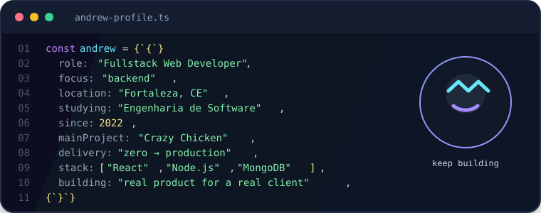

# `andrew.dev()` 👋

### Desenvolvedor Web Fullstack · foco em backend

**Fortaleza, CE** · construindo projetos reais, uma linha por vez.

 

 
 

## `whoami`

Comecei a programar pela **Programadores do Amanhã**, em 2022, e desde então venho aprendendo na prática, construindo projetos e me aprofundando cada vez mais em desenvolvimento web — especialmente no backend.

Atualmente curso **Engenharia de Software na UniAteneu** e já tive contato com projetos de empresas reais, trabalhando com código que chega à produção.

## ⭐ Projeto principal · Crazy Chicken

### Cardápio online e gestão de restaurante

O **Crazy Chicken** é o projeto mais completo e mais trabalhado que já desenvolvi: uma solução criada **do zero até o deploy** para um **cliente real**, publicada e funcionando em produção.

Mais do que uma tela de cardápio, a aplicação foi pensada como uma ferramenta de operação para o restaurante, com:

- cardápio digital responsivo e pensado primeiro para o celular;
- cadastro, edição e organização de produtos e categorias;
- gestão do conteúdo e da identidade visual do restaurante;
- fluxo de pedidos para clientes sem exigir cadastro no uso comum;
- integração do pedido com o atendimento do restaurante pelo WhatsApp;
- painel administrativo para controlar produtos, pedidos e informações exibidas;
- evolução completa da ideia inicial até uma aplicação publicada e em uso.

> **Entrega real:** planejamento → desenvolvimento → regras de negócio → painel de gestão → deploy → aplicação rodando para o cliente.

Esse é o projeto que melhor representa meu momento atual: construir uma aplicação fullstack completa, resolver necessidades de um negócio real e colocar o produto para funcionar fora do ambiente de desenvolvimento.

## Stack real

As ferramentas que fazem parte do meu caminho hoje:

### Frontend

### Backend & autenticação

### Dados, automação & IA

### Deploy

## Outros projetos que já construí

### [Automação de condomínios](https://github.com/andrewklayverr/automacaocond)

Automação voltada para pesquisa, validação e organização de dados, usando **Python**, **Selenium**, planilhas, geração de **PDF** e classificação com **Gemini Vision**.

### [Workout Exercise](https://portfolio-dev-liart.vercel.app/)

Aplicação fullstack para gerenciamento de treinos, com:

- autenticação com **JWT**;
- API REST em **Node.js + Express**;
- persistência no **MongoDB Atlas** usando **Mongoose**;
- frontend em **React** com **Context API**;
- deploy usando **Vercel** e **Render**.

Código: [github.com/andrewklayverr/workout-exercise](https://github.com/andrewklayverr/workout-exercise)

### [PetLoveQR](https://github.com/andrewklayverr/PetLoveQR)

Aplicação para criar páginas personalizadas de pets com foto, mensagem, música e QR Code. Projeto desenvolvido com **Next.js**, **Express**, **MongoDB** e **Cloudinary**.

### [Portfólio pessoal](https://github.com/andrewklayverr/portfolio-dev)

Meu portfólio publicado, construído com **React**, **Vite** e **Bootstrap**.

### [Sistema de Controle de Produtos](https://github.com/andrewklayverr/Sistema-de-Controle-de-Produtos)

Projeto frontend com **React**, formulários, rotas, **Axios**, validações com **Yup** e operações de CRUD.

## Commits em modo jogo

Meu histórico de contribuições ganhou uma camada extra: um jogo de cobrinha percorre o mapa dos commits. A animação é atualizada automaticamente pelo GitHub Actions.

## GitHub em números

## Próximo nível

Ainda sou júnior — e encaro isso como parte do processo. Quero trabalhar em projetos de maior escala, aprofundar meus conhecimentos em arquitetura de sistemas e continuar aprendendo com pessoas mais experientes.

Se você tem um projeto interessante ou uma oportunidade de estágio/júnior, vamos conversar. 🤝

> *Cada linha de código é uma chance de aprender algo novo.*

